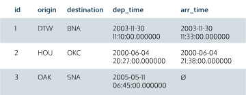

- [**`CONDITIONAL AGGREGATES`**](#conditional-aggregates)
  - [**Aggregate Functions Revisited**](#aggregate-functions-revisited)
  - [**NULL**](#null)
  - [**CASE WHEN**](#case-when)
  - [**COUNT(CASE WHEN )**](#countcase-when-)
  - [**SUM(CASE WHEN )**](#sumcase-when-)
  - [**Combining aggregates**](#combining-aggregates)
  - [**Combining aggregates II**](#combining-aggregates-ii)
  - [**Generalizations**](#generalizations)

# **`CONDITIONAL AGGREGATES`**

## **Aggregate Functions Revisited**
Aggregate functions compute a single result from a set of multiple input values. You can think of aggregate data as data collected from multiple rows at a time. In this lesson, we’ll continue learning about aggregate functions by focusing on conditionals, sums, and combining aggregate functions.

`Conditional Aggregates` are aggregate functions that compute a result set based on a given set of conditions.

## **NULL**
While working with databases, it’s common to have empty or unknown “cells” in data tables. For example, in our first flights table, we keep track of when `flights` arrive in a column called `arr_time`:



In this table, the third flight was canceled and therefore did not have an arrive time. We’ll leave this cell empty, which is denoted as `NULL`.

What do we do when we need to test whether a value is or is not null? We use the special keywords IS `NULL` or `IS NOT NULL` in the `WHERE` clause (= `NULL` does not work).
```
SELECT COUNT(*) AS 'FLIGHTS TO ATL'
FROM flights
WHERE destination = 'ATL'
AND arrival_time IS NOT NULL;
```

## **CASE WHEN**
Almost every programming language has a way to represent “if, then, else”, or conditional logic. In SQL, we represent this logic with the `CASE` statement, as follows:
```
SELECT
    CASE
        WHEN elevation < 500 THEN 'Low'
        WHEN elevation BETWEEN 500 AND 1999 THEN 'Medium'
        WHEN elevation >= 2000 THEN 'High'
        ELSE 'Unknown'
    END AS elevation_tier
    , COUNT(*)
FROM airports
GROUP BY 1;
```

In the above statement, `END` is required to terminate the statement, but `ELSE` is optional. If `ELSE` is not included, the result will be `NULL`. Also notice the shorthand method of referencing columns to use in `GROUP BY`, so we don’t have to rewrite the entire Case Statement.

## **COUNT(CASE WHEN )**
Sometimes you want to look at an entire result set, but want to implement conditions on certain aggregates.

For instance, maybe you want to identify the total amount of airports as well as the total amount of airports with high elevation in the same result set. We can accomplish this by putting a `CASE WHEN` statement in the aggregate.
```
SELECT    
    state, 
    COUNT(
        CASE 
            WHEN elevation >= 2000 THEN 1 
            ELSE NULL 
        END) as count_high_elevation_aiports 
FROM airports 
GROUP BY state;
```

## **SUM(CASE WHEN )**
We can do that same thing for other aggregates like SUM(). For instance, if we wanted to sum the total flight distance and compare that to the sum of flight distance from a particular airline (in this case, United Airlines) by origin airport, we could run the following query:
```
SELECT
  origin,
  SUM(distance) AS total_flight_distance,
  SUM(
    CASE
      WHEN carrier = 'DL' THEN distance
      ELSE 0
    END) AS total_delta_flight_distance
FROM flights
GROUP BY 1;
```

## **Combining aggregates**
Oftentimes we’d like to combine aggregates, to create percentages or ratios.

In the instance of the last query, we might want to find out the percent of flight distance that is from United by origin airport. We can do this simply by using the mathematical operators we need in SQL:
```
SELECT origin, 
    (100.0*(sum(CASE WHEN carrier = 'UN' THEN distance ELSE 0 END))/sum(distance)) as percentage_flight_distance_from_united FROM flights 
GROUP BY origin;
```

## **Combining aggregates II**
Modify the previous elevation example to find the percentage of high elevation airports (elevation >= 2000) by state.
```
SELECT
  state,
  100.0 * COUNT(CASE WHEN elevation >= 2000 THEN 1 ELSE NULL END) / COUNT(*) AS percentage_high_elevation_airports
FROM airports
GROUP BY state;
```

## **Generalizations**
What can we generalize so far?

- `Conditional Aggregates` are aggregate functions the compute a result set based on a given set of conditions.
- `NULL` can be used to denote an empty field value
- `CASE` statements allow for custom classification of data
- `CASE` statements can be used inside aggregates (like `SUM()` and `COUNT())` to provide filtered measures